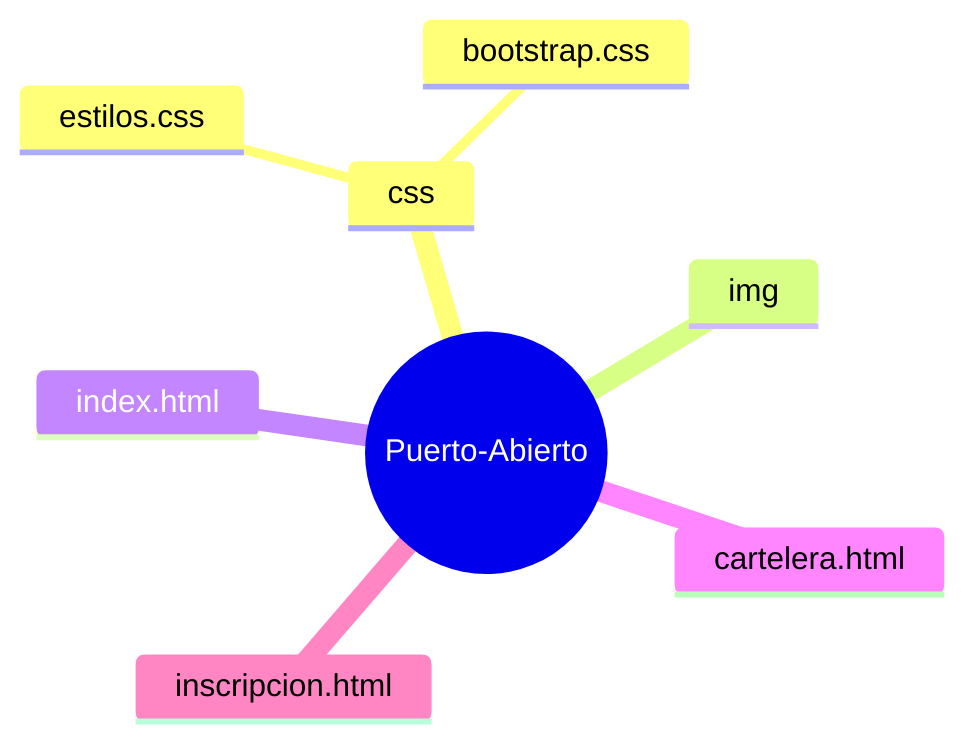

# Certamen 1 - Centro Cultural Puerto Abierto

## Estructura del Proyecto

## Inspirado por:
- [PuertoAbierto](https://www.facebook.com/PuertoAbierto?locale=es_LA)
- [cclm](https://www.cclm.cl/)
- [municoquimbo](https://www.municoquimbo.cl/index.php/noticias/esparcimiento/cultura)
- [ccespacioabierto](https://www.ccespacioabierto.com/galeria-talleres/)

## Fuente de imagenes
- https://www.facebook.com/ceramistasrenaca/
- https://cultura.ucsc.cl/talleres-de-danza/
- https://www.festivalchilejazz.com/edujazz/ 
- https://walkingstgo.cl/llega-a-gam-inedita-exposicion-sobre-la-historia-del-jazz-en-chile/
- https://tallerdemusics.com/todos-los-artistas/original-jazz-orquestra-taller-de-musics-ojo/
- https://www.soychile.cl/Valdivia/Cultura/2026/07/05/956461/taller-literario-escitura.html
- https://lospleimovil.cl/escuela-y-talleres/
- https://teatroaleph.cl/talleres/
- https://www.rayadosporlasfotos.com/cursos
- https://www.indap.gob.cl/noticias/sabores-del-campo-realizan-taller-de-cocina-ancestral-para-productoras-agricolas-de-la
- https://andesdelsurlab.cl/la-montana-se-abre-llega-a-valdivia-con-charlas-talleres-y-una-experiencia-participativa-sobre-los-andes-del-sur/

### Logo
- https://www.flaticon.es/icono-gratis/puerto_1183177?term=puerto&related_id=1183177

---